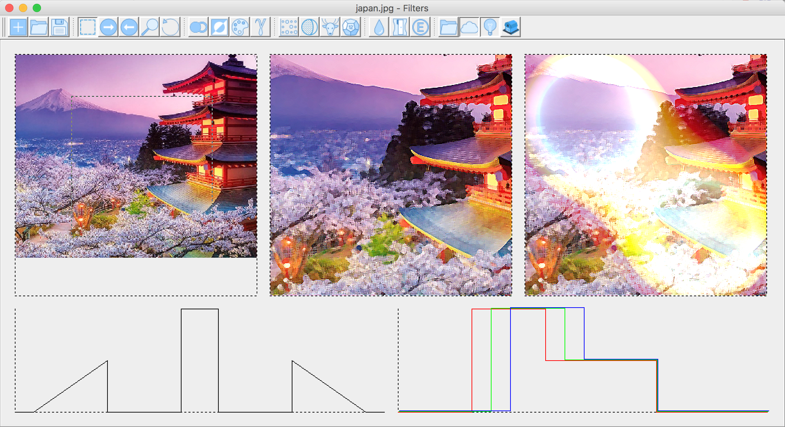

# Filter

In this project image editor implemented. User can edit image by applying different predefined filters to it.



Available filters:
- ```Negative``` 
- ```Grayscale```
- ```Watercolor effect```
- ```Gamma correction```
- ```Floyd-Steinberg Dithering```
- ```Roberts Edge Detection```
- ```Sobel Edge Detection```
- ```Anti-Aliasing```
- ```Sharpening```
- ```Embossing```

There is also volume rendering available. User can set the emission and absorption in config file using specified format. Emission and absorption can be rendered separately or both.


## Getting Started

These instructions will get you a copy of the project up and running on your local machine for development and testing purposes.

### Prerequisites

You need to have ```maven``` build-utility to build a project.

### Installing

A step by step series of examples that tell you how to get a development env running.

To build the project do the following:

```
cd filter/
mvn package
```

## Running the program

To run the program use command:

```
mvn exec:java
```

## Volume rendering file format
```$xslt
// absorption graph description
n_vertixes
x_coordinate_0 absorption_value_0
x_coordinate_1 absorption_value_1
...
x_coordinate_n-1 absorption_value_n-1
 
// emission graph description
m_vertixes
x_coordinate_0 red_emission_value_0 green_emission_value_0 blue_emission_value_0
x_coordinate_1 red_emission_value_1 green_emission_value_1 blue_emission_value_1
...
x_coordinate_m-1 red_emission_value_m-1 green_emission_value_m-1 blue_emission_value_m-1
 
// voxels with potential description
k_vertixes
x_0 y_0 z_0 potential_0
x_1 y_1 z_1 potential_1
...
x_k-1 y_k-1 z_k-1 potential_k-1
```