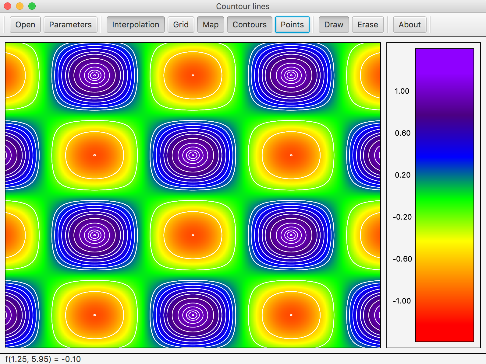

# Isolines

This project is an application that allows user to draw isolines of a two-variable function. 



Available features:
- ```Color Map and Color Interpolation modes```
- ```Show/Hide grid``` 
- ```Show/Hide control points```
- ```Erase user defined isolines```
- ```Set custom domain and grid size```
- ```Draggable isoline```

## Two-variable function

Two variable function description can be found in [this](src/ru/nsu/fit/g15201/sogreshilin/model/DiscreteFunction.java) file.


## Config file format

C-style comments and whitespaces can be used in config file. Config file has following format:

```$xslt
// grid size
width height
 
 
// z = f(x, y) key values
key_values_count
 
 
// palette rgb
// here n equals to key_values_count
red_0 green_0 blue_0
red_1 green_1 blue_1
...
red_n green_n blue_n
 
 
// isoline color
red green blue
```