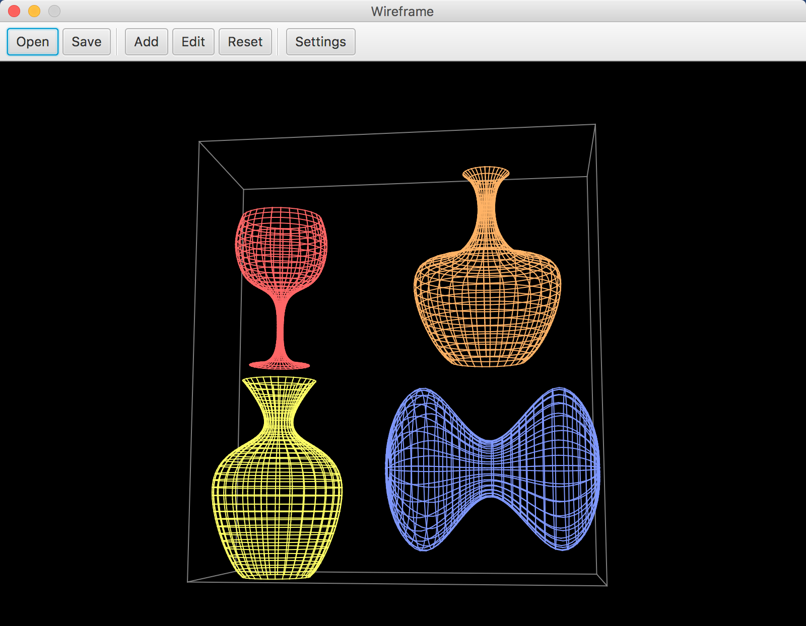

# Wireframe

This application allows to build revolution body out of generatrix which can be any b-spline curve.



Available features:
- ```Save and restore state```
- ```Add new or edit existing revolution body```
- ```Reset all rotation angles to zero```
- ```Show or hide axes```
- ```Rotate scene on mouse drag```
- ```Zoom scene on mouse zoom```

## Spline settings


In settings menu following parameters can be changed:
- ```U and V axes grid count, K parameter```. K parameter makes revolution body smoother
- ```Spline color```
- ```U and V domain```
- ```Revolution body center on the scene and rotation angles```


## Config file format

C-style comments and whitespaces can be used in config file. Config file has following format:

```$xslt
// ***** scene *****

// background color (int values between 0 and 255)
red green blue

// pyramid front (double)
value

// pyramid back (double)
value

// pyramid width (double)
value

// pyramid height (double)
value

// scene rotation angles in radians (double values)
// around Ox, Oy and Oz axes
x y z

// body count (int value)
value


// ***** body #1 *****

// u axes grid count (int value)
value

// v axes grid count (int value)
value

// k parameter
value

// domain (double values between 0 and 1)
// u start point
value

// u end point
value

// v start point
value

// v end point
value

// spline color (int values between 0 and 255)
red green blue

// control points count (int value)
value

// control points list: x, y coordinates (double values)
x y

```
